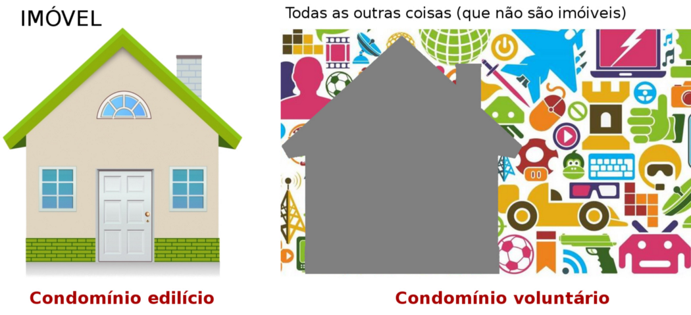

# Perguntas frequentes

## Como é a garantia do "Autista para Autista"?

O “dono do patrimònio” é um coletivo com 50% ou mais autistas. Esse coletivo é previsto no nosso Código Civil, no capítulo VI, na seção I o título “Condomínio Voluntário” ([artigos 1.314 a 1.326](http://www.planalto.gov.br/ccivil_03/Leis/2002/L10406.htm#parteespeciallivroiiitituloiiicapitulovise%C3%A7aoi)). Não é muito diferente de um condomínio de moradia (edilício), mas se aplica apenas a o que não é imóvel.

## O sistema está restrito a alguma especialidade?

Não há restrição de assunto, basta que as *tags* existam na [Wikidata](http://wikidata.org), e mesmo que não existam, a Wikidata permite adicionar.
Alguns exemplos de tags e suas categorias:

* [_zoologia_](http://www.wikidata.org/entity/Q431), tags:
   - [ornitologia](http://www.wikidata.org/entity/Q44703) (stack-Biology/[ornithology](https://biology.stackexchange.com/tags/ornithology))
	 - [parasitologia](http://www.wikidata.org/entity/Q180502) (stack-Biology/[parasitology](https://biology.stackexchange.com/tags/parasitology))

* [_Windows NT_](http://www.wikidata.org/entity/Q486487), tags:
  - [Windows 8](http://www.wikidata.org/entity/Q5046) (stack-geral/[windows-8](https://stackoverflow.com/tags/windows-8))
	  - [Windows XP](http://www.wikidata.org/entity/Q11248) (stack-geral/[windows-xp](https://stackoverflow.com/tags/windows-xp))

Os links externos como StackOverflow não são necessários, e podem ser para outros sites de controle.
O apelo tecnológico fica por conta do reuso de sites como StackOverflow onde podemos "puxar" o perfil do usuário automaticamente, resgatando a sua pontuação como grau de domínio.

## Como carregar automaticamente as minhas tags de sites como o StackOverflow?

## Quais atributos mais são amarrados à tags para dar peso?

## Como é feito o casamento candidato-vaga?

## Algum exemplo implementado?
Exemplos:

* http://hacka.c-qr.org/_sql/skill_tag?limit=50&offset=100
* http://hacka.c-qr.org/_sql/vw01consolid_skill_tag?limit=50&offset=100
* http://hacka.c-qr.org/_sql/vw02bycat_skill_tag?limit=50&offset=100
